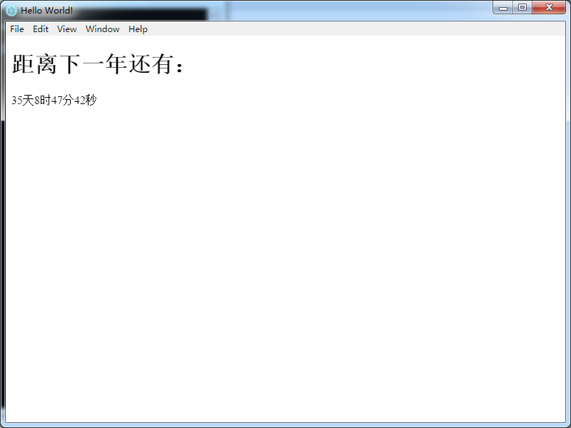

## 描述
1、js写桌面应用demo
2、基于electron
3、年底倒计时，或者某天至今的倒计时

### 安装
可以根据我的项目安装，或者参考 官方给的electron-quick-start
yarn 
本地开发
npm run start 
打包
npm run build

打包前先装两个插件
electron-packager
electron-prebuilt

如有报错可能还要装以下两个
builtin-modules
decamelize

亲测ok，可以发布本地exe应用程序（windows）

### 打包
可以参考
<a href="https://blog.csdn.net/HaoDaWang/article/details/78159989?locationNum=9&fps=1" target="_blank">https://blog.csdn.net/HaoDaWang/article/details/78159989?locationNum=9&fps=1</a>

### 官方quick-start
# Clone this repository
git clone https://github.com/electron/electron-quick-start
# Go into the repository
cd electron-quick-start
# Install dependencies
npm install
# Run the app
npm start

### 预览

##### 其他

